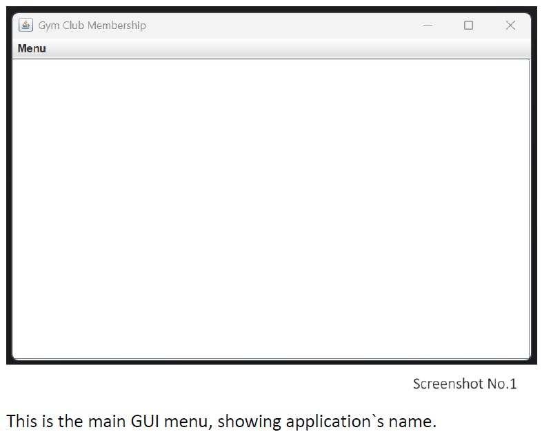
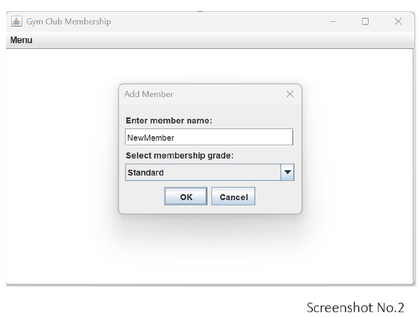
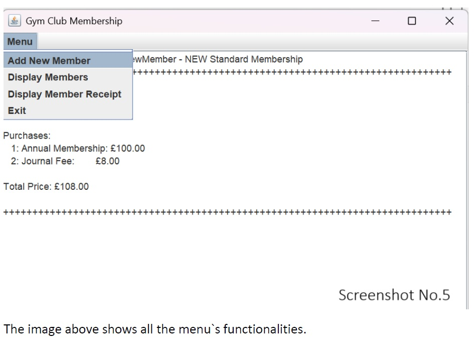
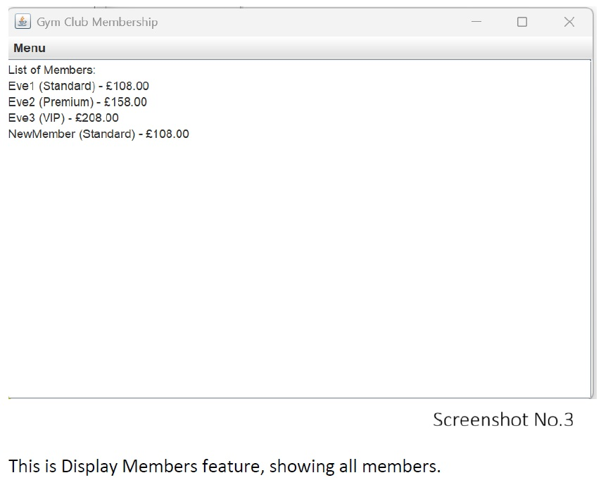
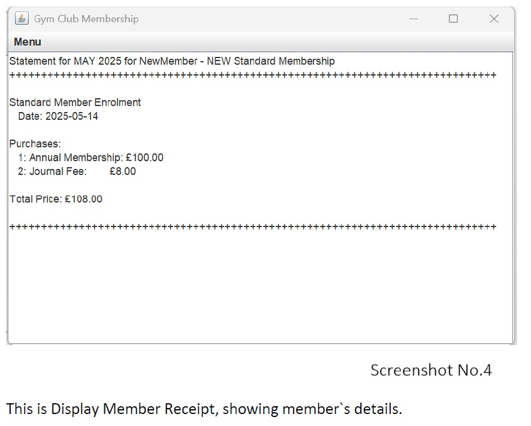

# 🏋️ GymClub

**GymClub** is a Java-based desktop application that allows gym stuff to:

- Add new members
- View a list of current members
- Display individual member receipts

Built using Java and designed to run in IntelliJ IDEA.

---

## 📦 Features

- Add new gym members with relevant details
- List all registered members
- View payment receipts per member

---

## 💻 Installation

### Requirements:
- Java 17 or newer
- IntelliJ IDEA (Community or Ultimate)

## 📸 Screenshots

Below are some screenshots demonstrating the GymClub Java application in action:

### 🧾 Main Interface

---

### 👥 Main Menu View

---

### 🧩 Menu Functionality

---

### 📋 Member List View

---

### 💳 Receipt Display

---

These images show the application's graphical user interface (GUI) and core functionality, including member management and receipt generation.
